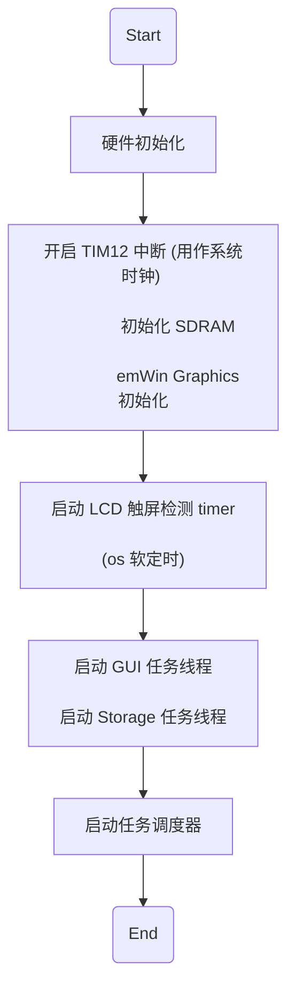
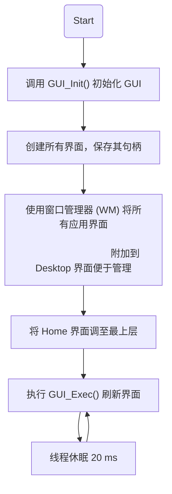

# 1. 前言

工程由 `CubeMX 5.3.0` 生成，建议使用相同版本的 CubeMX 生成工程，
因为高版本的 CubeMX 不再支持 emWin，所以用高版本 CubeMX 打开
工程会导致 emWin 相关文件丢失  :warning:


## 1.1 工程结构
```c
// CubeMX 生成代码之后的目录

├───.vscode
├───Drivers
│   ├───BSP                       // 官方固件驱动, 板子型号 STM32746G-Discovery
│   ├───CMSIS                   
│   └───STM32F7xx_HAL_Driver
├───EWARM                         // IAR 工程文件
├───Inc                           // CubeMX 自动生成的头文件目录
├───Middlewares                   // CubeMX 自动生成的第三方插件目录
│   ├───ST
│   │   ├───STemWin
│   │   └───STM32_USB_Device_Library
│   └───Third_Party
│       ├───FatFs
│       └───FreeRTOS
├───Src                            // CubeMX 自动生成的源码目录
├───STemWin                        // STemWin 的 GUI builder 生成的一些 Window 文件
│   └───App
└───Utilities                      // Utilities 是自己编写的一些功能
    ├───Alarm        // 闹钟功能
    ├───Audio        // 音频显示和录制功能，频谱显示功能
    ├───include      // 头文件目录
    ├───Music        // 音乐播放功能
    ├───OS           // 系统时间/系统状态
    ├───STemWin      // GUI
    └───Storage      // SD 卡读写
```


# 2. 软件流程图

## 2.1 主函数流程图




## 2.2 GUI 线程流程图




# x. 附录

## x.1 功能测试函数

### DSP 库测试

```c
#include "arm_math.h"
#include "arm_const_structs.h"


float32_t lBufInArray[256*2];
float32_t mag[256];
void testDSP()
{
  uint16_t NPT = 256;
  float32_t PI2 = 6.28318530;
  uint32_t Fs = 44800;
  unsigned short i;
  float32_t fx;
  for (i = 0; i < NPT; i++)
  {
    fx = 1500 * arm_sin_f32(PI2 * i * 350 / Fs) +
        2700 * arm_sin_f32(PI2 * i * 8400 / Fs) +
        4000 * arm_sin_f32(PI2 * i * 18725 / Fs);
    lBufInArray[2*i] = fx;
    lBufInArray[2*i+1] = 0;
  }

  arm_cfft_f32(&arm_cfft_sR_f32_len256, lBufInArray, 0, 1);
  arm_cmplx_mag_f32(lBufInArray, mag, 256);

  for (i = 0; i < NPT; i++)
    mag[i] = mag[i] / NPT * 2;

  return;
}
```

### SD 卡写入

```c
HAL_StatusTypeDef status;
uint8_t txBuf[512];
for(int i = 0; i < 512; i++)
    txBuf[i] = i;
status = HAL_SD_WriteBlocks(&hsd1, txBuf, 0, 1, 10000);
```

### FAT 文件系统测试

```c
// MX_FATFS_Init();

FRESULT ret[4];
ret[0] = f_mount(&SDFatFS, "", 0);
ret[1] = f_open(&SDFile, "test.txt", FA_CREATE_ALWAYS | FA_WRITE);
ret[2] = f_printf(&SDFile, "Hello, %d\n", 112);
ret[3] = f_close(&SDFile);
```

### SD 卡格式化为 FAT32 文件系统

```c
FRESULT result;
FATFS fs;           /* File system object for flash disk logical drive */
FIL fil;            /* File object */
FILINFO fno;
char spath[4]="";      /* SFLASH logical drive path */
BYTE work[512];
uint32_t br, bw;

typedef struct _filesystem_info_t
{
        int total_space;
        int free_space;
} filesystem_info;

filesystem_info fatfs_info;

filesystem_info fatfs_get_info(uint8_t *drv)
{
        FATFS *fs;
        uint8_t res;
        DWORD fre_clust=0, fre_sect=0, tot_sect=0;

        filesystem_info info;

        memset(&info, 0x0, sizeof(filesystem_info));

        res = f_getfree((const TCHAR*)drv, &fre_clust, &fs);
        if(res==0)
    {
                tot_sect = (fs->n_fatent - 2) * fs->csize;
                fre_sect = fre_clust * fs->csize;
                if(tot_sect<20480)
                {
            info.total_space = tot_sect>>1;
            info.free_space = fre_sect>>1;
                }
                else
                {
            info.total_space = tot_sect>>11;
            info.free_space = fre_sect>>11;
                }
    }

    return info;
}

void uctsk_lua_init(void)
{
    f_mount( &fs, (TCHAR const*) spath, 0 );
    fatfs_info = fatfs_get_info( (uint8_t*) spath );

    f_mkfs ( (TCHAR const*) spath, FM_ANY, 0, work, sizeof(work));
    fatfs_info = fatfs_get_info( (uint8_t*) spath );
}
```
